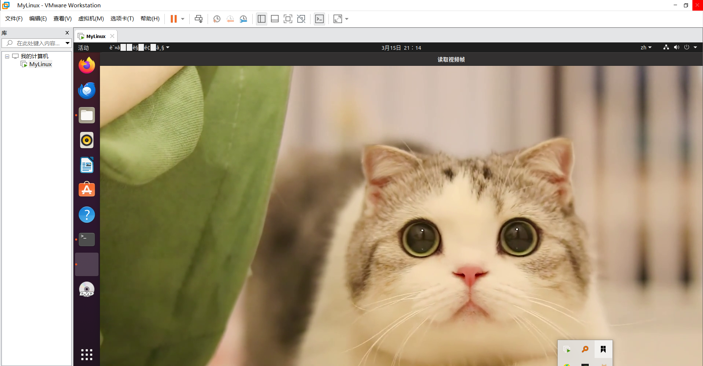

# OpenCV编程
(1)、示例代码第7行修改为VideoCapture capture("vido.mp4");

(2)、while 循环体中的 Mat 数据结构其实是一个点阵，对应图像上的每一个点，点的集合形成了一帧图像，语句：waitKey(30) ，中的参数单位是 ms 毫秒，也就是每一帧间隔 30 ms ，该语句时不能删除的，否则会执行错误，无法播放视频或录制视频。
(3)、加上案件判断可以在while循环条件里设置条件为waitKeyt(1)!=q。