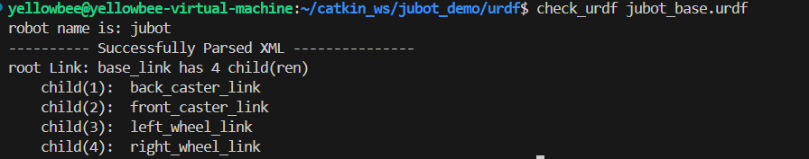
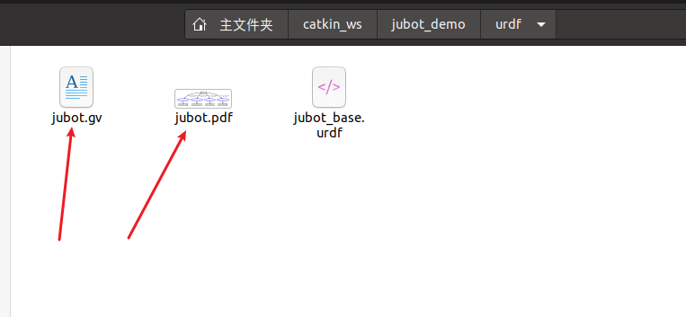
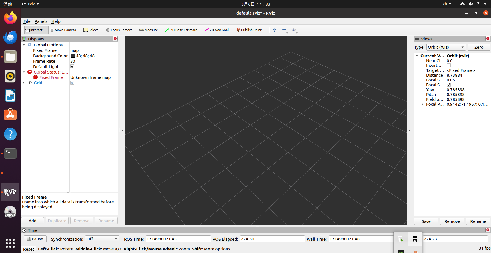
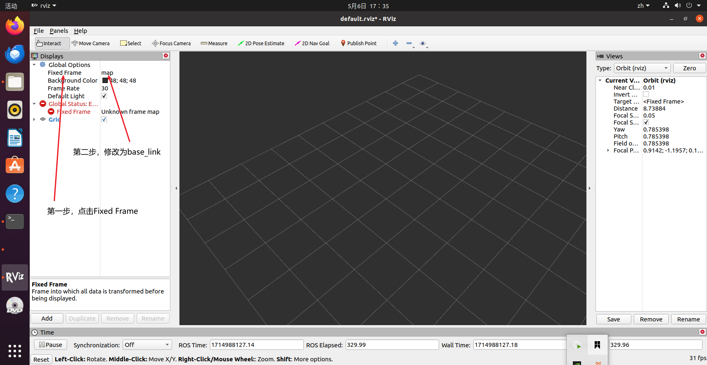
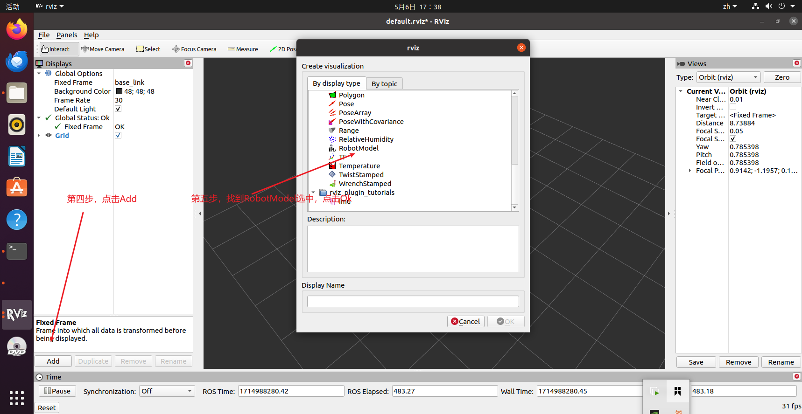
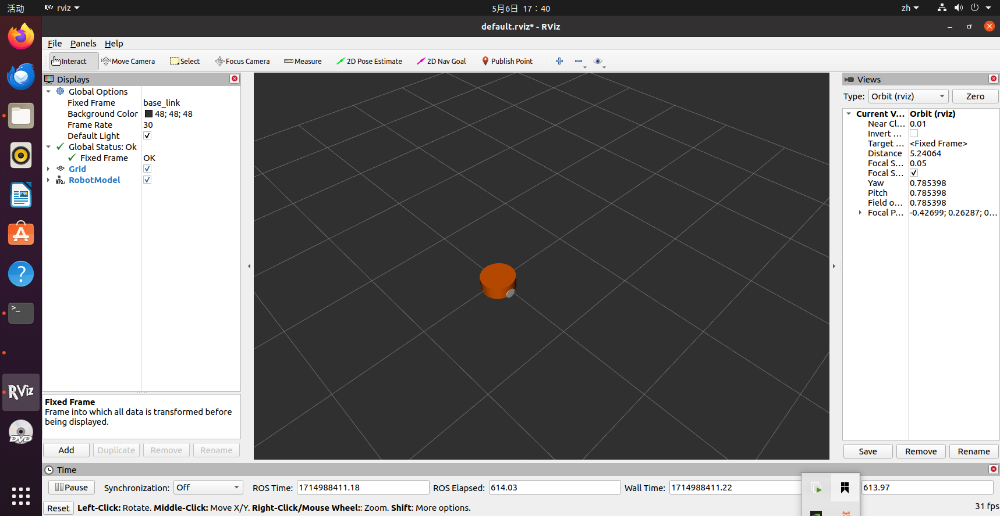
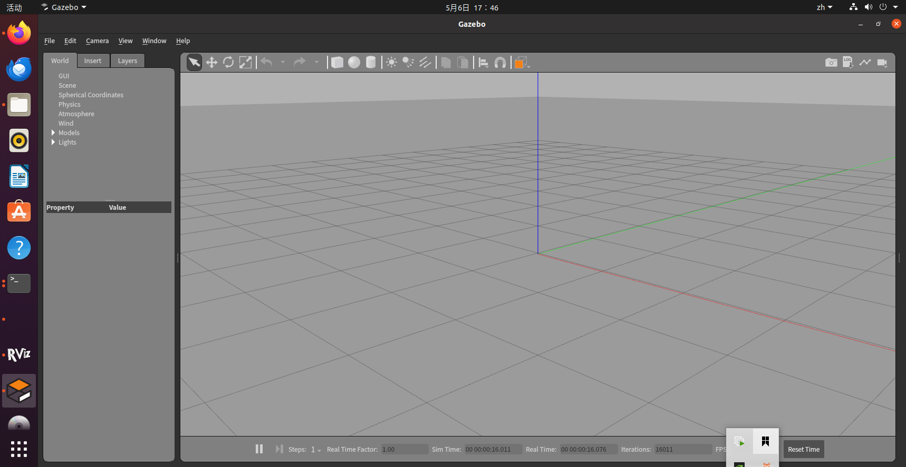
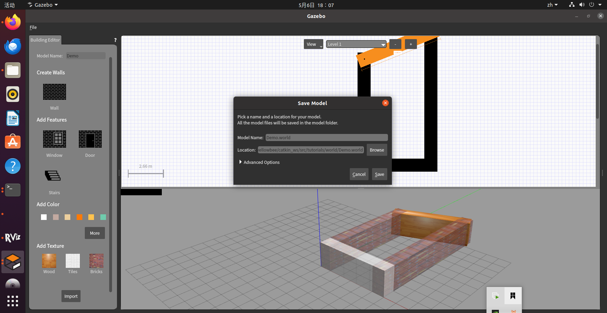
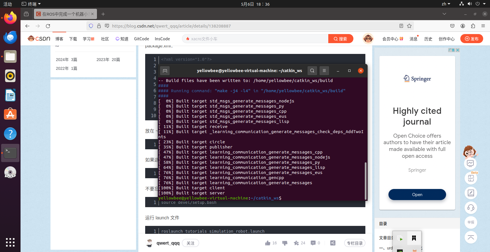
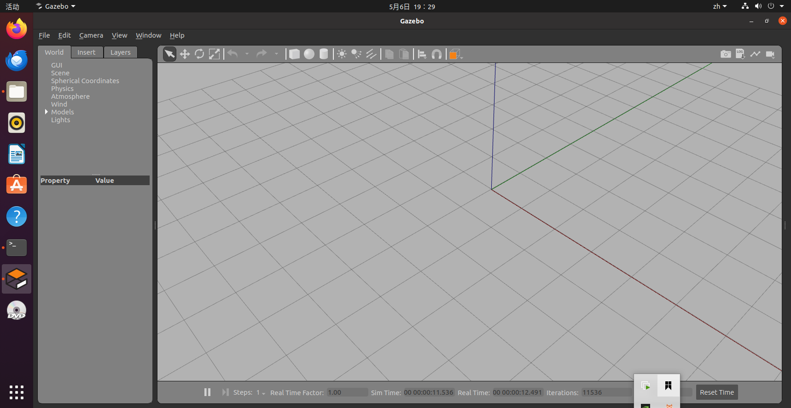

# ROS控制小车移动
[TOC]
## 添加依赖包
```
cd catkin_ws  #进入工作空间
catkin_create_pkg jubot_demo urdf xacro #创建功能包、添加依赖
cd jubot_demo/
mkdir urdf
mkdir launch
mkdir meshes #存放渲染机器人模型的文件
mkdir config #存放rviz配置的文件
touch jubot_base.urdf #创建在urdf文件夹下
touch display_jubot_base_urdf.launch #创建在launch文件夹下
```
## 分别复制以下内容到urdf文件下的jubot_base.urdf和launch文件夹下的display_jubot_base_urdf.launch
jubot_base.urdf文件
```
<?xml version="1.0" ?>
<robot name="jubot">
    
<!--base_car-->>
    <link name="base_link">   
        <visual> 
            <origin xyz="0.0 0.0 0.0" rpy="0.0 0.0 0.0"/> 
            <geometry>  
                <cylinder radius="0.20" length="0.16"/>             
            </geometry>
            <material name="yellow"> 
                <color rgba="1 0.4 0 1"/>  
            </material>
        </visual>
    </link>

<!--left_wheel-->>
    <joint name="left_wheel_joint" type="continuous">   
        <origin xyz="0.0 0.19 -0.05" rpy="0.0 0.0 0.0"/> 
        <parent link="base_link"/>  
        <child link="left_wheel_link"/> 
        <axis xyz="0.0 1.0 0.0"/>  
    </joint>

    <link name="left_wheel_link">
        <visual>
            <origin xyz="0.0 0.0 0.0" rpy="1.5707 0.0 0.0"/>
            <geometry>
                <cylinder radius="0.06" length="0.025"/>
            </geometry>
            <material name="white">
                <color rgba="1 1 1 0.9"/>
            </material>
        </visual>
    </link>
 
<!--right_wheel-->>
    <joint name="right_wheel_joint" type="continuous">
        <origin xyz="0.0 -0.19 -0.05"/>
        <parent link="base_link"/>
        <child link="right_wheel_link"/>
        <axis xyz="0.0 1.0 0.0"/>
    </joint>

    <link name="right_wheel_link">
        <visual>
            <origin xyz="0.0 0.0 0.0" rpy="1.5707 0.0 0.0"/>
            <geometry>
                <cylinder radius="0.06" length="0.025"/>
            </geometry>
            <material name="white">
                <color rgba="1 1.0 1.0 0.9"/>
            </material>
        </visual>
    </link>

<!--front_caster-->
    <joint name="front_caster_joint" type="continuous">
        <origin xyz="0.18 0.0 -0.095" rpy="0.0 0.0 0.0"/>
        <parent link="base_link"/>
        <child link="front_caster_link"/>
        <axis xyz="0.0 1.0 0.0"/>
    </joint>

    <link name="front_caster_link">
        <visual>
            <origin xyz="0.0 0.0 0.0" rpy="0.0 0.0 0.0"/>
                <geometry>
                    <sphere radius="0.015"/>
                </geometry>
                <material name="black">
                    <color rgba="0.0 0.0 0.0 0.95"/>
                </material>
        </visual>
    </link>

<!--back_caster-->
    <joint name="back_caster_joint" type="continuous">
        <origin xyz="-0.18 0.0 -0.095" rpy="0.0 0.0 0.0"/>
        <parent link="base_link"/>
        <child link="back_caster_link"/>
        <axis xyz="0.0 1.0 0.0"/>
    </joint>

    <link name="back_caster_link">
        <visual>
            <origin xyz="0.0 0.0 0.0" rpy="0.0 0.0 0.0"/>
                <geometry>
                    <sphere radius="0.015"/>
                </geometry>
            <material name="black">
                <color rgba="0.0 0.0 0.0 0.95"/>
            </material>
        </visual>
    </link>
</robot>
```
display_jubot_base_urdf.launch
```
<launch>
	<!-- 设置机器人模型路径参数 -->
	<param name="robot_description" textfile="$(find jubot_demo)/urdf/jubot_base.urdf" />

	<!-- 运行joint_state_publisher节点，发布机器人的关节状态  -->
	<node name="joint_state_publisher_gui" pkg="joint_state_publisher_gui" type="joint_state_publisher_gui" />
	
	<!-- 运行robot_state_publisher节点，发布tf  -->
	<node name="robot_state_publisher" pkg="robot_state_publisher" type="robot_state_publisher" />
	
	<!-- 运行rviz可视化界面 -->
    <node name="rviz" pkg="rviz" type="rviz" args="-d $(find jubot_demo)/config/jubot_urdf.rviz" required="true" />  
</launch>
```
## 图形化显示
安装urdf语法检查工具
```
sudo apt-get install liburdfdom-tools
cd urdf
check_urdf jubot_base.urdf #打卡语法检查
```

会生成两个文件

```
urdf_to_graphiz jubot_base.urdf #图形化显示urdf模型
rviz
```
如果报错：RLException: [xx.launch] is neither a launch file in package [x] nor is [x] a launch file name
则是没有添加环境变量
[解决办法](https://blog.csdn.net/weixin_44436677/article/details/106442240)
如果打开像这样没有小车模型

[解决网址](https://blog.csdn.net/lololyuu/article/details/134465289)


完整效果如图

## 绘制地图
```
mkdir -p ~/catkin_ws/src/tutorials  #创建文件夹
cd ~/catkin_ws/src/tutorials
mkdir launch  #存放 launch 文件
mkdir urdf  #存放小车模型文件
mkdir world  #存放地图文件
sudo gazebo  #打开gazebo，后续保存文件可能需要管理员权限
```

点击Edit，选择Building Editor
编辑好后点击File，Save，文件后缀需要加上.world保存在World文件夹下

## 小车模型文件
### xacro模型文件
进入tutorials文件夹下的urdf文件夹
```
touch mybot.xacro
touch mybot.gazebo.xacro
vim mybot.xacro
```
mybot.xacro复制一下内容：
```
<?xml version="1.0"?>  
<robot name="mybot" xmlns:xacro="http://ros.org/wiki/xacro">  

  <xacro:include filename="$(find tutorials)/urdf/mybot.gazebo.xacro" /> 

  <link name="base_footprint"/>

  <joint name="base_joint" type="fixed">  
    <parent link="base_footprint"/>  
    <child link="base_link"/>  
    <origin rpy="0 0 0" xyz="0 0 0"/>  
  </joint>  
  
  <link name="base_link">  
    <inertial>
     <origin xyz="0 0 0" rpy="0 0 0"/>
     <mass value="0.1"/>
     <inertia ixx="0.0001"  ixy="0"  ixz="0" iyy="0.0001" iyz="0" izz="0.001" />
    </inertial>

    <visual>  
      <geometry>  
        <box size="0.25 0.16 0.05"/>  
      </geometry>  
      <origin rpy="0 0 0" xyz="0 0 0"/>  
      <material name="blue">  
          <color rgba="0 0 0.8 1"/>  
      </material>  
    </visual>  

   <collision>
     <origin xyz="0 0 0" rpy="0 0 0"/>
     <geometry>
       <box size="0.25 0.16 0.05"/>
     </geometry>
   </collision>

  </link>  
 
  <link name="right_wheel_link">  
    <inertial>
     <origin xyz="0 0 0" rpy="0 0 0"/>
     <mass value="0.1"/>
     <inertia ixx="0.0001"  ixy="0"  ixz="0" iyy="0.0001" iyz="0" izz="0.0001" />
    </inertial>

    <visual>  
      <geometry>  
        <cylinder length="0.02" radius="0.025"/>  
      </geometry>  
      <material name="black">  
        <color rgba="0 0 0 1"/>  
      </material>  
    </visual>  

    <collision>
     <origin xyz="0 0 0" rpy="0 0 0"/>
     <geometry>
       <cylinder length="0.02" radius="0.025"/> 
     </geometry>
    </collision>
  </link>  
 
  <joint name="right_wheel_joint" type="continuous">  
    <axis xyz="0 0 -1"/>  
    <parent link="base_link"/>  
    <child link="right_wheel_link"/>  
    <origin rpy="1.5707 0 0" xyz=" 0.1 -0.09 -0.03"/>  
  </joint>  
 
  <link name="left_wheel_link">  
    <inertial>
     <origin xyz="0 0 0" rpy="0 0 0"/>
     <mass value="0.1"/>
     <inertia ixx="0.0001"  ixy="0"  ixz="0" iyy="0.0001" iyz="0" izz="0.0001" />
    </inertial>

    <visual>  
      <geometry>  
        <cylinder length="0.02" radius="0.025"/>  
      </geometry>  
      <material name="black">  
        <color rgba="0 0 0 1"/>  
      </material>  
    </visual>  

    <collision>
     <origin xyz="0 0 0" rpy="0 0 0"/>
     <geometry>
       <cylinder length="0.02" radius="0.025"/> 
     </geometry>
    </collision>   
  </link>  
 
  <joint name="left_wheel_joint" type="continuous">  
    <axis xyz="0 0 -1"/>  
    <parent link="base_link"/>  
    <child link="left_wheel_link"/>  
    <origin rpy="1.5707 0 0" xyz="0.1 0.09 -0.03"/>  
  </joint>  
 
  <link name="ball_wheel_link">  
    <inertial>
     <origin xyz="0 0 0" rpy="0 0 0"/>
     <mass value="0.1"/>
     <inertia ixx="0"  ixy="0"  ixz="0" iyy="0" iyz="0" izz="0" />
    </inertial>

    <visual>  
      <geometry>  
        <sphere radius="0.025"/>  
      </geometry>  
      <material name="black">  
        <color rgba="0 0 0 1"/>  
      </material>  
    </visual>  

    <collision>
     <origin xyz="0 0 0" rpy="0 0 0"/>
     <geometry>
       <sphere radius="0.025"/> 
     </geometry>
    </collision>   
  </link>  

  <joint name="ball_wheel_joint" type="fixed">  
    <axis xyz="0 0 1"/>  
    <parent link="base_link"/>  
    <child link="ball_wheel_link"/>  
    <origin rpy="0 0 0" xyz="-0.10 0 -0.03"/>  
  </joint>  
  <!-- imu sensor -->
  <link name="imu">  
    <visual>  
      <geometry>  
        <box size="0.01 0.01 0.01"/>  
      </geometry>  
      <material name="white">  
          <color rgba="1 1 1 1"/>  
      </material>  
    </visual>  
  </link>  

  <joint name="imu_joint" type="fixed">  
    <parent link="base_link"/>  
    <child link="imu"/>  
    <origin xyz="0.08 0 0.025"/>  
  </joint> 

  <!-- camera -->
  <link name="base_camera_link">  
    <visual>  
      <geometry>  
        <box size="0.02 0.03 0.03"/>  
      </geometry>  
      <material name="white">  
          <color rgba="1 1 1 1"/>  
      </material>  
    </visual>  
  </link>  

  <joint name="camera_joint" type="fixed">  
    <parent link="base_link"/>  
    <child link="base_camera_link"/>  
    <origin xyz="0.1 0 0.025"/>  
  </joint> 
  <!-- laser lidar -->
  <link name="base_laser_link">  
    <visual>  
      <geometry>  
        <cylinder length="0.06" radius="0.04"/>   
      </geometry>  
      <material name="white">  
          <color rgba="1 1 1 1"/>  
      </material>  
    </visual>  
  </link>  
  
  <joint name="laser_joint" type="fixed">  
    <parent link="base_link"/>  
    <child link="base_laser_link"/>  
    <origin xyz="0 0.0 0.06"/>  
  </joint> 

</robot>
```
```
vim mybot.gazebo.xacro
```
mybot.gazebo.xacro复制以下内容：
```
<?xml version="1.0"?>
<robot name="mybot" xmlns:xacro="http://ros.org/wiki/xacro">
  <xacro:arg name="laser_visual" default="false"/>
  <xacro:arg name="camera_visual" default="false"/>
  <xacro:arg name="imu_visual"   default="false"/>

  <gazebo reference="base_link">
    <material>Gazebo/DarkGrey</material>
  </gazebo>

  <gazebo reference="left_wheel_link">
    <mu1>0.5</mu1>
    <mu2>0.5</mu2>
    <kp>500000.0</kp>
    <kd>10.0</kd>
    <minDepth>0.001</minDepth>
    <maxVel>1.0</maxVel>
    <fdir1>1 0 0</fdir1>
    <material>Gazebo/DarkGrey</material>
  </gazebo>

  <gazebo reference="right_wheel_link">
    <mu1>0.5</mu1>
    <mu2>0.5</mu2>
    <kp>500000.0</kp>
    <kd>10.0</kd>
    <minDepth>0.001</minDepth>
    <maxVel>1.0</maxVel>
    <fdir1>1 0 0</fdir1>
    <material>Gazebo/FlatBlack</material>
  </gazebo>

  <gazebo reference="ball_wheel_link">
    <mu1>0.1</mu1>
    <mu2>0.1</mu2>
    <kp>500000.0</kp>
    <kd>100.0</kd>
    <minDepth>0.001</minDepth>
    <maxVel>1.0</maxVel>
    <material>Gazebo/FlatBlack</material>
  </gazebo>

  <gazebo reference="imu">
    <sensor type="imu" name="imu">
      <always_on>true</always_on>
      <visualize>$(arg imu_visual)</visualize>
    </sensor>
    <material>Gazebo/FlatBlack</material>
  </gazebo>

  <gazebo>
    <plugin name="mybot_controller" filename="libgazebo_ros_diff_drive.so">
      <commandTopic>cmd_vel</commandTopic>
      <odometryTopic>odom</odometryTopic>
      <odometryFrame>odom</odometryFrame>
      <odometrySource>world</odometrySource>
      <publishOdomTF>true</publishOdomTF>
      <robotBaseFrame>base_footprint</robotBaseFrame>
      <publishWheelTF>false</publishWheelTF>
      <publishTf>true</publishTf>
      <publishWheelJointState>true</publishWheelJointState>
      <legacyMode>false</legacyMode>
      <updateRate>30</updateRate>
      <leftJoint>left_wheel_joint</leftJoint>
      <rightJoint>right_wheel_joint</rightJoint>
      <wheelSeparation>0.180</wheelSeparation>
      <wheelDiameter>0.05</wheelDiameter>
      <wheelAcceleration>10</wheelAcceleration>
      <wheelTorque>100</wheelTorque>
      <rosDebugLevel>na</rosDebugLevel>
    </plugin>
  </gazebo>

  <gazebo>
    <plugin name="imu_plugin" filename="libgazebo_ros_imu.so">
      <alwaysOn>true</alwaysOn>
      <bodyName>imu</bodyName>  
      <frameName>imu</frameName>
      <topicName>imu</topicName>
      <serviceName>imu_service</serviceName>
      <gaussianNoise>0.0</gaussianNoise>
      <updateRate>0</updateRate>
      <imu>
        <noise>
          <type>gaussian</type>
          <rate>
            <mean>0.0</mean>
            <stddev>2e-4</stddev>
            <bias_mean>0.0000075</bias_mean>
            <bias_stddev>0.0000008</bias_stddev>
          </rate>
          <accel>
            <mean>0.0</mean>
            <stddev>1.7e-2</stddev>
            <bias_mean>0.1</bias_mean>
            <bias_stddev>0.001</bias_stddev>
          </accel>
        </noise>
      </imu>
    </plugin>
  </gazebo>

  <gazebo reference="base_laser_link">
    <material>Gazebo/FlatBlack</material>
    <sensor type="ray" name="rplidar_sensor">
      <pose>0 0 0 0 0 0</pose>
      <visualize>$(arg laser_visual)</visualize>
      <update_rate>7</update_rate>
      <ray>
        <scan>
          <horizontal>
            <samples>720</samples>
            <resolution>0.5</resolution>
            <min_angle>0.0</min_angle>
            <max_angle>6.28319</max_angle>
          </horizontal>
        </scan>
        <range>
          <min>0.120</min>
          <max>12.0</max>
          <resolution>0.015</resolution>
        </range>
        <noise>
          <type>gaussian</type>
          <mean>0.0</mean>
          <stddev>0.01</stddev>
        </noise>
      </ray>
      <plugin name="gazebo_ros_rplidar_controller" filename="libgazebo_ros_laser.so">
        <topicName>scan</topicName>
        <frameName>base_laser_link</frameName>
      </plugin>
    </sensor>
  </gazebo>

  <gazebo reference="base_camera_link">
    <sensor type="camera" name="csi Camera">
      <always_on>true</always_on>
      <visualize>$(arg camera_visual)</visualize>
      <camera>
          <horizontal_fov>1.085595</horizontal_fov>
          <image>
              <width>640</width>
              <height>480</height>
              <format>R8G8B8</format>
          </image>
          <clip>
              <near>0.03</near>
              <far>100</far>
          </clip>
      </camera>
      <plugin name="camera_controller" filename="libgazebo_ros_camera.so">
        <alwaysOn>true</alwaysOn>
        <updateRate>30.0</updateRate>
        <cameraName>/</cameraName>
        <frameName>base_camera_link</frameName>
        <imageTopicName>image_raw</imageTopicName>
        <cameraInfoTopicName>camera_info</cameraInfoTopicName>
        <hackBaseline>0.07</hackBaseline>
        <distortionK1>0.0</distortionK1>
        <distortionK2>0.0</distortionK2>
        <distortionK3>0.0</distortionK3>
        <distortionT1>0.0</distortionT1>
        <distortionT2>0.0</distortionT2>
      </plugin>
    </sensor>
  </gazebo>

</robot>
```
### ROS 运行环境和小车模型
创建在launch文件夹下创建gazebo_world.launch和simulation_robot.launch文件
```
touch gazebo_world.launch
touch simulation_robot.launch
vim gazebo_world.launch
```
gazebo_world复制以下内容:(地图需要修改为自己保存时的地图名)
```
<launch>
  <include file="$(find gazebo_ros)/launch/empty_world.launch">
    <arg name="world_name" value="$(find tutorials)/world/Demo.world"/>  // 注意这里是你的地图文件名
    <arg name="paused" value="false"/>
    <arg name="use_sim_time" value="true"/>
    <arg name="gui" value="true"/>
    <arg name="headless" value="false"/>
    <arg name="debug" value="false"/>
  </include>
</launch>
```
simulation_robot.launch复制以下内容：
```
<launch>
  <arg name="x_pos" default="0.0"/>
  <arg name="y_pos" default="0.0"/>
  <arg name="z_pos" default="0.0"/>
  <param name="/use_sim_time" value="true" />  
  
  <include file="$(find tutorials)/launch/gazebo_world.launch"/>

  <param name="robot_description" command="$(find xacro)/xacro --inorder $(find tutorials)/urdf/mybot.xacro" />

  <node pkg="gazebo_ros" type="spawn_model" name="spawn_urdf" args="-urdf -model mybot.xacro -x $(arg x_pos) -y $(arg y_pos) -z $(arg z_pos) -param robot_description" />

  <node name="robot_state_publisher" pkg="robot_state_publisher" type="robot_state_publisher" />

</launch>
```
### 编译配置
在catkin_ws/src/tutorials 文件夹下创建CMakeLists.txt和package.xml文件
CMakeLists.txt复制以下内容：
```
cmake_minimum_required(VERSION 2.8.3)
project(tutorials)

find_package(catkin REQUIRED COMPONENTS)
```
package.xml复制以下内容：
```
<?xml version="1.0"?>
<package format="2">
  <name>tutorials</name>
  <version>0.0.0</version>
  <description>The tutorials package</description>

  <maintainer email="nan@todo.todo">nanorobot</maintainer>

  <license>TODO</license>
</package>
```
在 ~/catkin_ws 文件夹下 catkin 编译
```
catkin_make
```
编译结果：

运行launch文件
```
roslaunch tutorials simulation_robot.launch 
```
结果如图：

不知道为什么没有加载上地图，之后想要通过gazebo打开之前制作的地图，打开后地图也只有空白，没有了之前制作的的四面墙，研究很久无果也决定放弃。
[参考网址](https://blog.csdn.net/qwert_qqq/article/details/138208887)