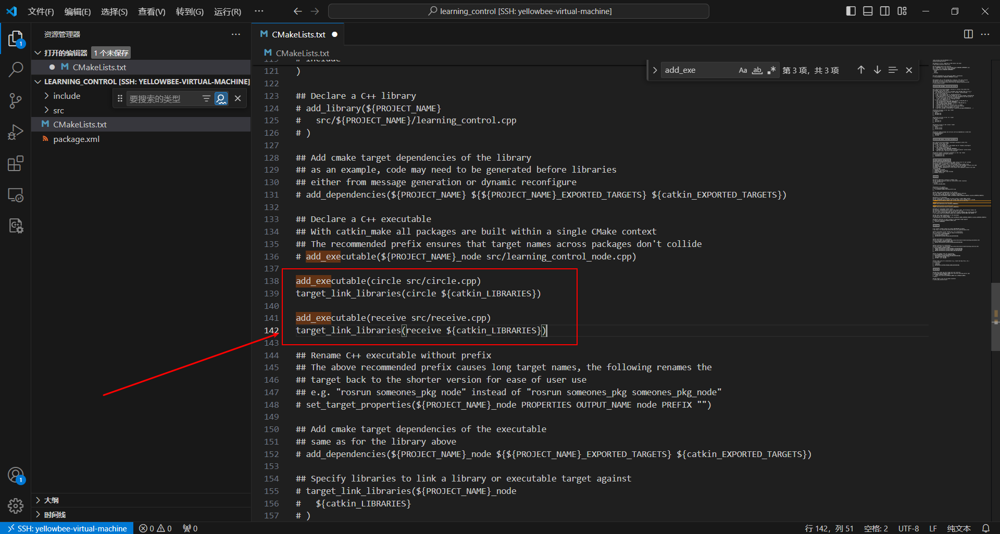
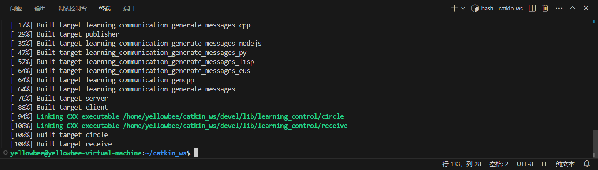

# ROS控制乌龟画圆
[TOC]
## 初始化工作空间
```
cd ~/catkin_ws
# 检查环境变量
echo $ROS_PACKAGE_PATH
# 创建功能包
cd catkin_ws/src
catkin_create_pkg learning_control std_msgs rospy roscpp
# 编译
cd ..
catkin_make
# 进入learning_control/src
```
## 编写画圆代码
创建circle.cpp
```
touch circle.cpp
vim circle.cpp
```
复制以下内容：
```
#include "ros/ros.h"
#include "std_msgs/String.h"
#include<geometry_msgs/Twist.h> //运动速度结构体类型  geometry_msgs::Twist的定义文件
 
int main(int argc, char *argv[])
{
    ros::init(argc, argv, "vel_ctrl");  //对该节点进行初始化操作
    ros::NodeHandle n;         //申明一个NodeHandle对象n，并用n生成一个广播对象vel_pub
    ros::Publisher vel_pub = n.advertise<geometry_msgs::Twist>("/turtle1/cmd_vel", 10);
    ros::Publisher chatter_pub = n.advertise<std_msgs::String>("chatter", 1000);
    ros::Rate loop_rate(10);
    //vel_pub会在主题"/turtle1/cmd_vel"(机器人速度控制主题)里广播geometry_msgs::Twist类型的数据
    //ros::Rate loopRate(2);
    ROS_INFO("draw_circle start...");//输出显示信息
    while(ros::ok())
    {
        geometry_msgs::Twist vel_cmd; //声明一个geometry_msgs::Twist 类型的对象vel_cmd，并将速度的值赋值到这个对象里面

        vel_cmd.linear.x = 2.0;//前后（+-） m/s
        vel_cmd.linear.y = 0.0;  //左右（+-） m/s
        vel_cmd.linear.z = 0.0;
 
        vel_cmd.angular.x = 0;
        vel_cmd.angular.y = 0;
        vel_cmd.angular.z = 1.8; //机器人的自转速度，+左转，-右转，单位是rad/s

        vel_pub.publish(vel_cmd); //赋值完毕后，发送到主题"/turtle1/cmd_vel"。机器人的核心节点会从这个主题接受发送过去的速度值，并转发到硬件体上去执行
	std_msgs::String msg;
        std::stringstream ss;//定义输出流对象
        ss <<vel_cmd;
        msg.data = ss.str();
    	/**
     	* The publish() function is how you send messages. The parameter
     	* is the message object. The type of this object must agree with the type
     	* given as a template parameter to the advertise<>() call, as was done
     	* in the constructor above.
     	*/
        chatter_pub.publish(msg);
        ros::spinOnce();//调用此函数给其他回调函数得以执行(比例程未使用回调函数)
       //loopRate.sleep();
    }
    return 0;
}

```
## 编写接收代码
```
touch receive.cpp
vim receive.cpp
```
复制以下内容：
```
#include "ros/ros.h"
#include "std_msgs/String.h"
 
/**
 * This tutorial demonstrates simple receipt of messages over the ROS system.
 */
void chatterCallback(const std_msgs::String::ConstPtr& msg)
{
  ROS_INFO("it is location: [%s]", msg->data.c_str());
}
 
int main(int argc, char **argv)
{
  /**
   * The ros::init() function needs to see argc and argv so that it can perform
   * any ROS arguments and name remapping that were provided at the command line. For programmatic
   * remappings you can use a different version of init() which takes remappings
   * directly, but for most command-line programs, passing argc and argv is the easiest
   * way to do it.  The third argument to init() is the name of the node.
   *
   * You must call one of the versions of ros::init() before using any other
   * part of the ROS system.
   */
  ros::init(argc, argv, "yuan");
 
  /**
   * NodeHandle is the main access point to communications with the ROS system.
   * The first NodeHandle constructed will fully initialize this node, and the last
   * NodeHandle destructed will close down the node.
   */
  ros::NodeHandle n;
 
  /**
   * The subscribe() call is how you tell ROS that you want to receive messages
   * on a given topic.  This invokes a call to the ROS
   * master node, which keeps a registry of who is publishing and who
   * is subscribing.  Messages are passed to a callback function, here
   * called chatterCallback.  subscribe() returns a Subscriber object that you
   * must hold on to until you want to unsubscribe.  When all copies of the Subscriber
   * object go out of scope, this callback will automatically be unsubscribed from
   * this topic.
   *
   * The second parameter to the subscribe() function is the size of the message
   * queue.  If messages are arriving faster than they are being processed, this
   * is the number of messages that will be buffered up before beginning to throw
   * away the oldest ones.
   */
  ros::Subscriber sub = n.subscribe("chatter", 1000, chatterCallback);
 
  /**
   * ros::spin() will enter a loop, pumping callbacks.  With this version, all
   * callbacks will be called from within this thread (the main one).  ros::spin()
   * will exit when Ctrl-C is pressed, or the node is shutdown by the master.
   */
  ros::spin();
 
  return 0;
}
```
## 修改CMakeLists.txt
```
cd ..
vim CMakeLists.txt
```
添加以下内容：
```
add_executable(circle src/circle.cpp)
target_link_libraries(circle ${catkin_LIBRARIES})

add_executable(receive src/receive.cpp)
target_link_libraries(receive ${catkin_LIBRARIES})
```

## 编译并运行
```
cd ~/catkin_ws
catkin_make
```

由于远程连接不能展示图形化界面，所以转到虚拟机上运行以下command：
```
roscore
# 新起终端
rosrun learning_control circle
# 新起终端
rosrun learning_control receive
# 新起终端
rosrun turtlesim turtlesim_node
```
