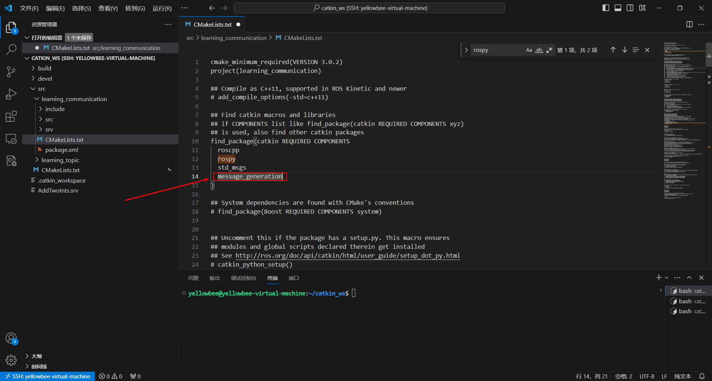
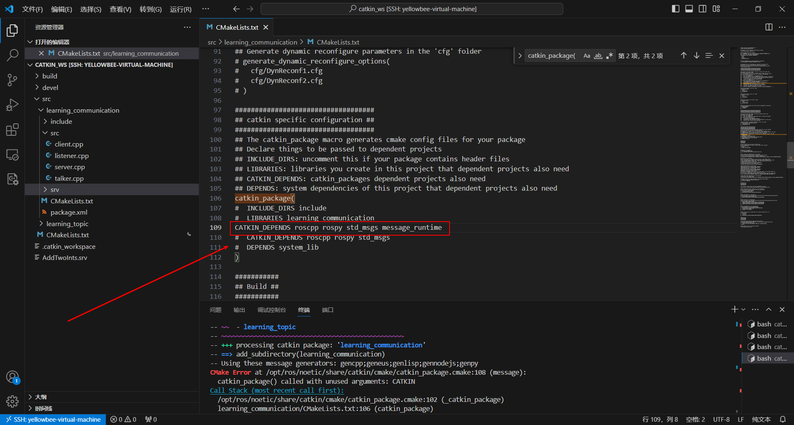
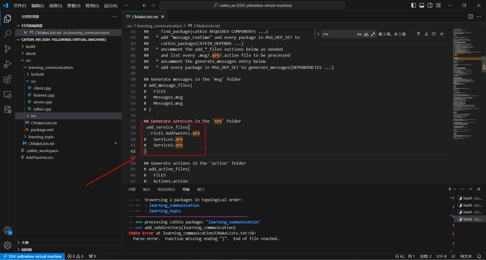
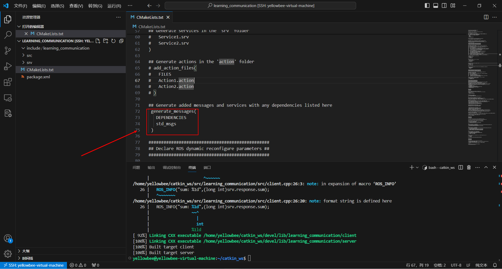
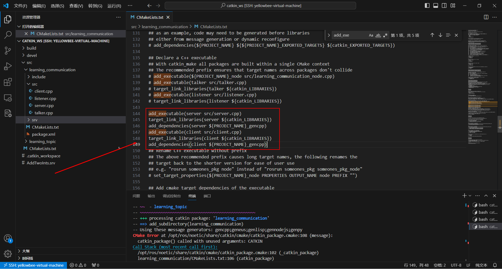
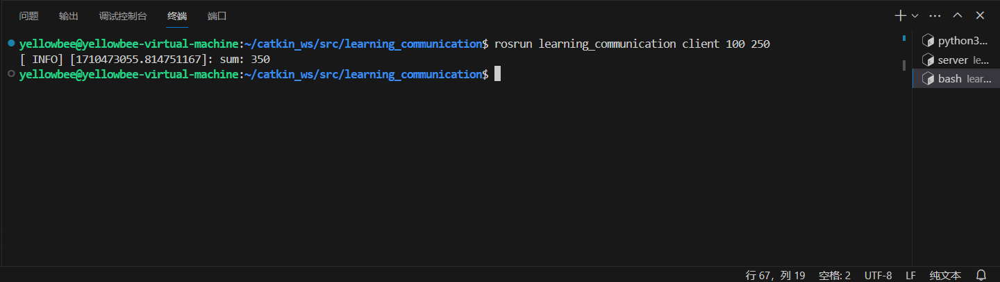
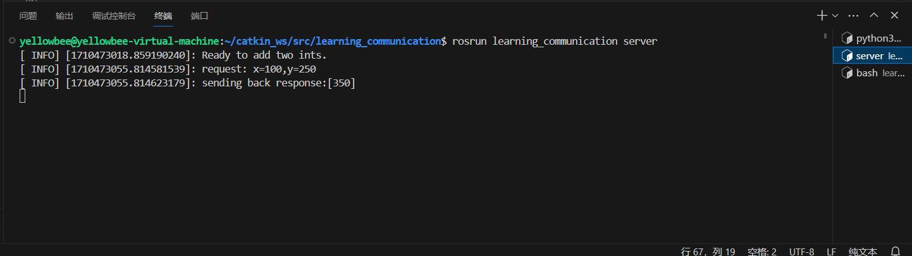

# ROS通信编程
[TOC]
## 一、准备工作
### 1、创建工作空间
```
	mkdir -p ~/catkin_ws/src#创建文件夹
	cd ~/catkin_ws/src#进入目录
	catkin_init_workspace#初始化，使其成为ROS的工作空间
```
### 2、编译工作空间
```
cd ..
catkin_make
```

### 3、设置环境变量
```
source /home/usr/catkin_ws/devel/setup.bash#该环境变量设置只对当前终端有效，usr是指当前用户名
#将上面命令放置到~/.bashrc文件中，让其对所有终端都有效
sudo nano ~/.bashrc
```
### 4、检查环境变量
```
echo $ROS_PACKAGE_PATH
```

### 5、创建功能包
```
cd ~/catkin_ws/src
catkin_create_pkg learning_communication std_msgs rospy roscpp
#catkin_create_pkg 功能包名字 依赖
#std_msgs：定义的标准的数据结构
#rospy：提供python编程接口 
#roscpp：提供c++编程接口
```

### 6、编译功能包
```
cd ~/catkin_ws
catkin_make
```

## 二、ROS通信编程
### 1、话题编程
首先进入catkin_ws/src/learning_communication/src
```
cd src/learning_communication/src
```
#### (1)、发布者：
创建talker.cpp
```
touch talker.cpp
vim talker.cpp
```
复制如下代码：
```
#include<sstream>
#include"ros/ros.h"
#include"std_msgs/String.h"
int main(int argc,char **argv)
{
	//ROS节点初始化
	ros::init(argc,argv,"talker");
	//创建节点句柄
	ros::NodeHandle n;
	//创建一个Publisher，发布名为chatter的topic，消息类型为std_msgs::String
	ros::Publisher chatter_pub=n.advertise<std_msgs::String>("chatter",1000);
	//设置循环的频率
	ros::Rate loop_rate(10);
	int count=0;
	while(ros::ok())
	{
		//初始化std_msgs::String类型的消息
		std_msgs::String msg;
		std::stringstream ss;
		ss<<"hello world"<<count;
		msg.data=ss.str();
		//发布消息
		ROS_INFO("%s",msg.data.c_str());
		chatter_pub.publish(msg);
		//循环等待回调函数
		ros::spinOnce();
		//接受循环频率延时
		loop_rate.sleep();
		++count;
	}
	return 0;
}
```
#### (2)、订阅者：
```
touch listener.cpp
vim listener.cpp
```
复制以下代码：
```
#include"ros/ros.h"
#include"std_msgs/String.h"
//接收到订阅的消息，会进入消息的回调函数
void chatterCallback(const std_msgs::String::ConstPtr& msg)
{
	//将接收到的消息打印处理
	ROS_INFO("I heard:{%s}",msg->data.c_str());
}
int main(int argc,char **argv)
{
	//初始化ROS节点
	ros::init(argc,argv,"listener");
	//创建节点句柄
	ros::NodeHandle n;
	//创建一个Subscriber，订阅名为chatter的topic，注册回调函数chatterCallback
	ros::Subscriber sub=n.subscribe("chatter",1000,chatterCallback);
	//循环等待回调函数
	ros::spin();
	return 0;
}
```
#### (3)、设置CMakeLists.txt
```
cd ..#回到上一级
vim CMakeLists.txt
```
加入如下内容：
```
add_executable(talker src/talker.cpp)
target_link_libraries(talker ${catkin_LIBRARIES})
add_executable(listener src/listener.cpp)
target_link_libraries(listener ${catkin_LIBRARIES})
```

回到workspace根目录然后编译：
```
cd ~/catkin_ws
catkin_make
```

生成的可执行talker和listener文件在catkin_ws/devel/lib/learning_communication目录下

运行可执行文件：
```
roscore
#新起一个终端
rosrun learning_communication talker
#新起一个终端
rosrun learning_communication listener
```
 

### 2、服务编程
#### (1)、定义srv文件
```
mkdir ~/catkin_ws/src/learning_communication/srv
cd ~/catkin_ws/src/learning_communication/srv
vim AddTwoInts.srv
```
添加如下内容：
```
int64 a
int64 b
---
int64 sum
```
#### (2)、在package.xml中添加功能包依赖
```
<build_depend>message_generation</build_depend>
<exec_depend>message_runtime</exec_depend>
```

修改CMakeLists.txt




#### (3)、创建服务器
进入catkin_ws/src/learning_communication/srv目录，并创建server.cpp
```
cd catkin_ws/src/learning_communication/srv
touch server.cpp
```
复制以下内容：
```
#include<ros/ros.h>
#include"learning_communication/AddTwoInts.h"
//service回调函数，输入参数req，输出参数res
bool add(learning_communication::AddTwoInts::Request &req,learning_communication::AddTwoInts::Response &res)
{
	//将输入的参数中的请求数据相加，结果放到应答变量中
	res.sum=req.a+req.b;
	ROS_INFO("request: x=%1d,y=%1d",(long int)req.a,(long int)req.b);
	ROS_INFO("sending back response:[%1d]",(long int)res.sum);
	return true;
}
int main(int argc,char **argv)
{
	//ROS节点初始化
	ros::init(argc,argv,"add_two_ints_server");
	//创建节点句柄
	ros::NodeHandle n;
	//创建一个名为add_two_ints的server,注册回调函数add()
	ros::ServiceServer service=n.advertiseService("add_two_ints",add);
	//循环等待回调函数
	ROS_INFO("Ready to add two ints.");
	ros::spin();
	return 0;
}
```
#### (4)、创建客户端
复制如下内容：
```
#include<cstdlib>
#include<ros/ros.h>
#include"learning_communication/AddTwoInts.h"
int main(int argc,char **argv)
{
	//ROS节点初始化
	ros::init(argc,argv,"add_two_ints_client");
	//从终端命令行获取两个加数
	if(argc!=3)
	{
		ROS_INFO("usage:add_two_ints_client X Y");
		return 1;
	}
	//创建节点句柄
	ros::NodeHandle n;
	//创建一个client，请求add_two_ints_service
	//service消息类型是learning_communication::AddTwoInts
	ros::ServiceClient client=n.serviceClient<learning_communication::AddTwoInts>("add_two_ints");
	//创建learning_communication::AddTwoInts类型的service消息
	learning_communication::AddTwoInts srv;
	srv.request.a=atoll(argv[1]);
	srv.request.b=atoll(argv[2]);
	//发布service请求，等待加法运算的应答请求
	if(client.call(srv))
	{
		ROS_INFO("sum: %1d",(long int)srv.response.sum);
	}
	else
	{
		ROS_INFO("Failed to call service add_two_ints");
		return 1;
	}
	return 0;
}
```
#### (5)、设置CMakeLists.txt
添加一下内容：

然后回到根目录编译

#### (6)、运行
```
roscore
# 新起终端
rosrun learning_communication server
# 新起终端
rosrun learning_communication client 整数1 整数2
```

