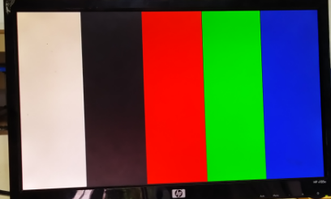

# 实验二 VGA
[TOC]
## 程序实现
### 时钟分频模块
```V
640x480像素的VGA协议所需时钟频率25MHZ，使用clk IP核进行时钟分频
module vga_colorbar_top(
       input    wire                sys_clk ,
       input    wire                sys_rst,
       
       output   wire                vga_hs,        
       output   wire                vga_vs,       
       output   wire    [15:0]  vga_rgb         
);
wire clk_w ;
​
pll_clk pll_25MHz(
    .inclk0 (sys_clk), 
    .c3     (clk_w)
 );
 ```

### VGA驱动模块
 pixel_hpos用来计算当前刷新到了哪一行，pixel_vpos用来计算当前刷新到了哪一列。当刷新到640列时vga_vs产生脉冲1，当刷新倒480行时vga_hs产生脉冲1。pixel_data[15:0]，其中[4:0]是蓝色，[10:5]是绿色，[15:11]是红色，vga_rgb[15:0]表示输出RGB颜色信号，接入到显示器的信号
 ```v
module vga_driver(
    input   wire            clk_25MHz,
    input   wire                rst, 
    input   wire        [15:0]  pixel_data, 
    output  wire        [  9:0] pixel_hpos, 
    output  wire        [  9:0] pixel_vpos, 
    output  wire                vga_hs, 
    output  wire                vga_vs, 
    output  wire        [15:0]  vga_rgb
);
​parameter           H_SYNC      = 10'd96; 
parameter           H_BACK      = 10'd48; 
parameter           H_DISP      = 10'd640; 
parameter           H_FRONT     = 10'd16;
parameter           H_PRIOD     = 10'd800;  
parameter           V_SYNC      = 10'd2;  
parameter           V_BACK      = 10'd33;   
parameter           V_DISP      = 10'd480;  
parameter           V_FRONT     = 10'd10;  
parameter           V_PRIOD = 10'd525;
​assign  pixel_hpos = pixel_data_require ? (cnt_h - (H_SYNC + H_BACK - 1'b1)) : 10'd0;
assign  pixel_vpos = pixel_data_require ? (cnt_v - (V_SYNC + V_BACK - 1'b1)) : 10'd0;
​assign vga_rgb = vga_en ? pixel_data:16'd0;
//输出颜色竖条
always @ (posedge clk_25MHz or negedge rst)begin
    if(!rst)begin
        pixel_data <= BLACK;
    end
    else begin
        if(pic_area == 1'b0)begin
            if (pixel_hpos >= 0 && pixel_hpos <= (H_DISP / 5) * 1)
                pixel_data <= WHITE;
            else if (pixel_hpos >= (H_DISP / 5) * 1 && pixel_hpos < (H_DISP / 5) * 2)
                pixel_data <= BLACK;
            else if (pixel_hpos >= (H_DISP / 5) * 2 && pixel_hpos < (H_DISP / 5) * 3)
                pixel_data <= RED;
            else if (pixel_hpos >=(H_DISP / 5) * 3 && pixel_hpos < (H_DISP / 5) * 4)
                pixel_data <= GREEN;
            else
                pixel_data <= BLUE;
        end
    end
end
```
### 效果：
