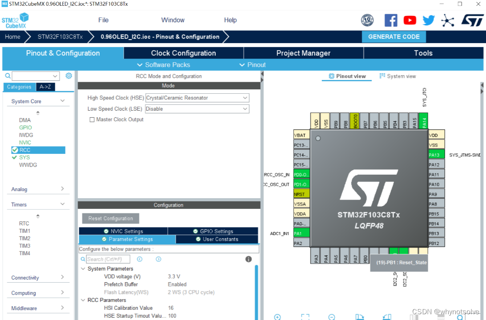
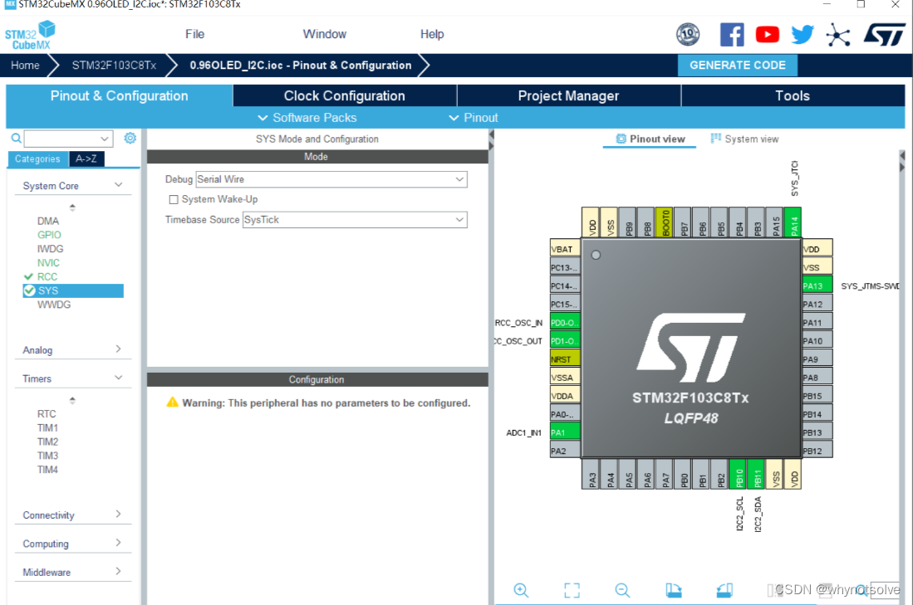
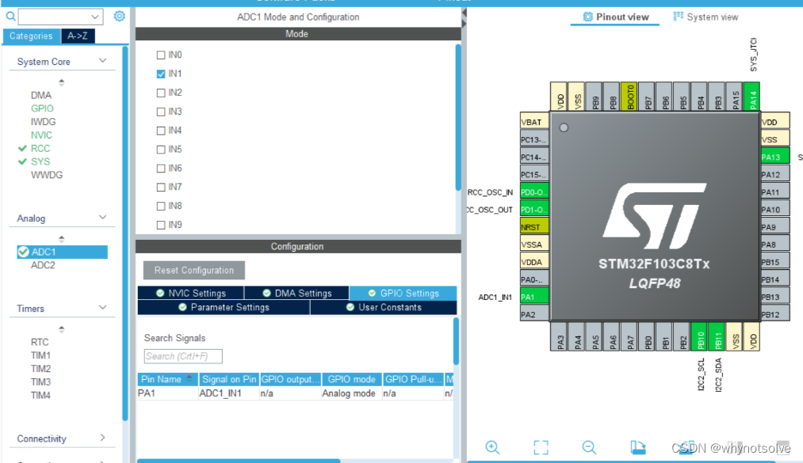
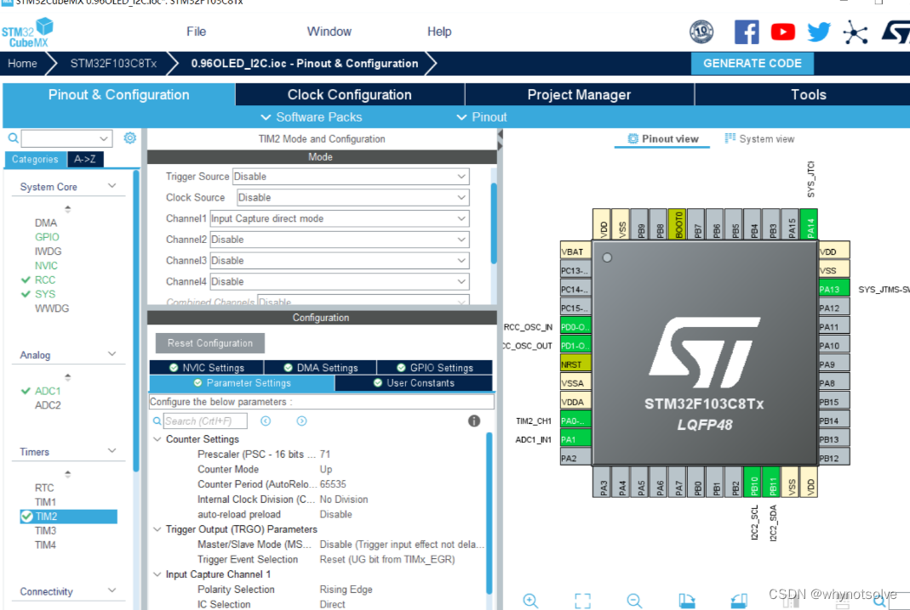
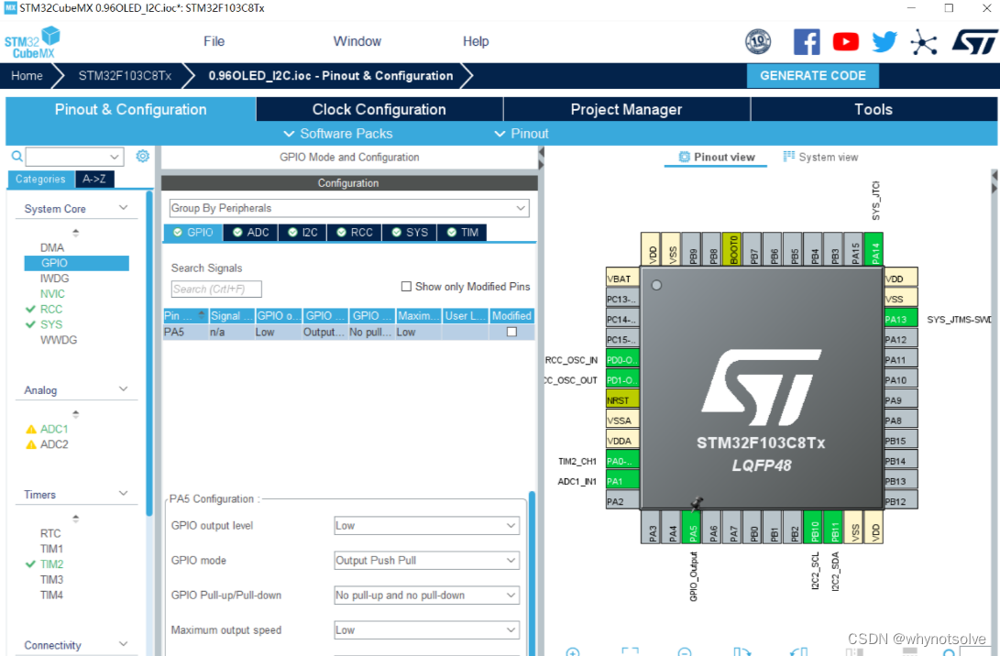
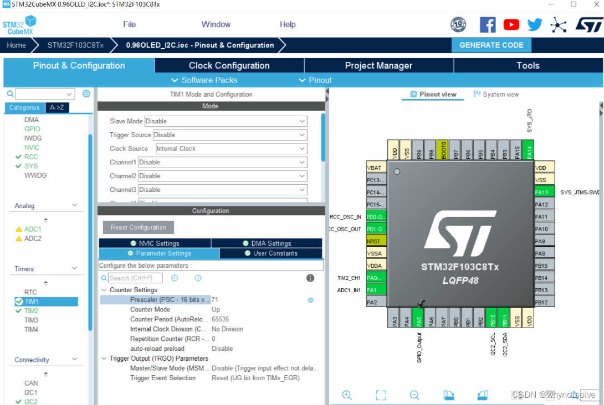

# 实验三红外超声波雷达测距
[TOC]
## HC-SR04基本工作原理
(1)采用IO口TRIG触发测距，给最少10us的高电平信呈。
(2)模块自动发送8个40khz的方波，自动检测是否有信号返回；
(3)有信号返回， 通过IO口ECHO输出一个高电平， 高电平持续的时间就是超声波从发射到返回的时间。
## 引脚连接：
VCC --> VCC
GND --> GND
Trig --> PA5
Echo --> PA0
## 工程配置
RCC配置外部高速晶振

SYS的Debug设置成Serial Wire

ADC1配置ADC-IN1模数转换

设置定时器TIM2每1us向上计数一次 ，通道1为上升沿捕获并连接到超声波模块的ECHO引脚

PA5接到了HC-SR04的TRIG触发引脚，默认输出低电平

由上面可知HC-SR04的使用需要us级的延迟函数,HAL库自带只有ms的，所以需要自己设计一个定时器

超声波模块代码：
HC-SR04.h
```cpp
    #ifndef HCSR04_H_
    #define HCSR04_H_
     
    #include "main.h"
    #include "delay.h"
     
    typedef struct
    {
     uint8_t  edge_state;
     uint16_t tim_overflow_counter;
     uint32_t prescaler;
     uint32_t period;
     uint32_t t1; // 上升沿时间
     uint32_t t2; // 下降沿时间
     uint32_t high_level_us; // 高电平持续时间
     float    distance;
     TIM_TypeDef* instance;
        uint32_t ic_tim_ch;
     HAL_TIM_ActiveChannel active_channel;
    }Hcsr04InfoTypeDef;
     
    extern Hcsr04InfoTypeDef Hcsr04Info;
     
    /**
     * @description: 超声波模块的输入捕获定时器通道初始化
     * @param {TIM_HandleTypeDef} *htim
     * @param {uint32_t} Channel
     * @return {*}
     */
    void Hcsr04Init(TIM_HandleTypeDef *htim, uint32_t Channel);
     
    /**
     * @description: HC-SR04触发
     * @param {*}
     * @return {*}
     */
    void Hcsr04Start();
     
    /**
     * @description: 定时器计数溢出中断处理函数
     * @param {*}    main.c中重定义void HAL_TIM_PeriodElapsedCallback(TIM_HandleTypeDef* htim)
     * @return {*}
     */
    void Hcsr04TimOverflowIsr(TIM_HandleTypeDef *htim);
     
    /**
     * @description: 输入捕获计算高电平时间->距离
     * @param {*}    main.c中重定义void HAL_TIM_IC_CaptureCallback(TIM_HandleTypeDef *htim)
     * @return {*}
     */
    void Hcsr04TimIcIsr(TIM_HandleTypeDef* htim);
     
    /**
     * @description: 读取距离 
     * @param {*}
     * @return {*}
     */
    float Hcsr04Read();
     
    #endif /* HCSR04_H_ */
```
HC-SR04.c
```cpp
    #include "hc-sr04.h"
     
    Hcsr04InfoTypeDef Hcsr04Info;
     
    /**
     * @description: 超声波模块的输入捕获定时器通道初始化
     * @param {TIM_HandleTypeDef} *htim
     * @param {uint32_t} Channel
     * @return {*}
     */
    void Hcsr04Init(TIM_HandleTypeDef *htim, uint32_t Channel)
    {
      /*--------[ Configure The HCSR04 IC Timer Channel ] */
      // MX_TIM2_Init();  // cubemx中配置
      Hcsr04Info.prescaler = htim->Init.Prescaler; //  72-1
      Hcsr04Info.period = htim->Init.Period;       //  65535
     
      Hcsr04Info.instance = htim->Instance;        //  TIM2
      Hcsr04Info.ic_tim_ch = Channel;
      if(Hcsr04Info.ic_tim_ch == TIM_CHANNEL_1)
      {
        Hcsr04Info.active_channel = HAL_TIM_ACTIVE_CHANNEL_1;             //  TIM_CHANNEL_4
      }
      else if(Hcsr04Info.ic_tim_ch == TIM_CHANNEL_2)
      {
        Hcsr04Info.active_channel = HAL_TIM_ACTIVE_CHANNEL_2;             //  TIM_CHANNEL_4
      }
      else if(Hcsr04Info.ic_tim_ch == TIM_CHANNEL_3)
      {
        Hcsr04Info.active_channel = HAL_TIM_ACTIVE_CHANNEL_3;             //  TIM_CHANNEL_4
      }
      else if(Hcsr04Info.ic_tim_ch == TIM_CHANNEL_4)
      {
        Hcsr04Info.active_channel = HAL_TIM_ACTIVE_CHANNEL_4;             //  TIM_CHANNEL_4
      }
      else if(Hcsr04Info.ic_tim_ch == TIM_CHANNEL_4)
      {
        Hcsr04Info.active_channel = HAL_TIM_ACTIVE_CHANNEL_4;             //  TIM_CHANNEL_4
      }
      /*--------[ Start The ICU Channel ]-------*/
      HAL_TIM_Base_Start_IT(htim);
      HAL_TIM_IC_Start_IT(htim, Channel);
    }
     
    /**
     * @description: HC-SR04触发
     * @param {*}
     * @return {*}
     */
    void Hcsr04Start()
    {
      HAL_GPIO_WritePin(TRIG_GPIO_Port, TRIG_Pin, GPIO_PIN_SET);
      DelayUs(10);  //  10us以上
      HAL_GPIO_WritePin(TRIG_GPIO_Port, TRIG_Pin, GPIO_PIN_RESET);
    }
     
    /**
     * @description: 定时器计数溢出中断处理函数
     * @param {*}    main.c中重定义void HAL_TIM_PeriodElapsedCallback(TIM_HandleTypeDef* htim)
     * @return {*}
     */
    void Hcsr04TimOverflowIsr(TIM_HandleTypeDef *htim)
    {
      if(htim->Instance == Hcsr04Info.instance) //  TIM2
      {
        Hcsr04Info.tim_overflow_counter++;
      }
    }
     
    /**
     * @description: 输入捕获计算高电平时间->距离
     * @param {*}    main.c中重定义void HAL_TIM_IC_CaptureCallback(TIM_HandleTypeDef *htim)
     * @return {*}
     */
    void Hcsr04TimIcIsr(TIM_HandleTypeDef* htim)
    {
      if((htim->Instance == Hcsr04Info.instance) && (htim->Channel == Hcsr04Info.active_channel))
      {
        if(Hcsr04Info.edge_state == 0)      //  捕获上升沿
        {
          // 得到上升沿开始时间T1，并更改输入捕获为下降沿
          Hcsr04Info.t1 = HAL_TIM_ReadCapturedValue(htim, Hcsr04Info.ic_tim_ch);
          __HAL_TIM_SET_CAPTUREPOLARITY(htim, Hcsr04Info.ic_tim_ch, TIM_INPUTCHANNELPOLARITY_FALLING);
          Hcsr04Info.tim_overflow_counter = 0;  //  定时器溢出计数器清零
          Hcsr04Info.edge_state = 1;        //  上升沿、下降沿捕获标志位
        }
        else if(Hcsr04Info.edge_state == 1) //  捕获下降沿
        {
          // 捕获下降沿时间T2，并计算高电平时间
          Hcsr04Info.t2 = HAL_TIM_ReadCapturedValue(htim, Hcsr04Info.ic_tim_ch);
          Hcsr04Info.t2 += Hcsr04Info.tim_overflow_counter * Hcsr04Info.period; //  需要考虑定时器溢出中断
          Hcsr04Info.high_level_us = Hcsr04Info.t2 - Hcsr04Info.t1; //  高电平持续时间 = 下降沿时间点 - 上升沿时间点
          // 计算距离
          Hcsr04Info.distance = (Hcsr04Info.high_level_us / 1000000.0) * 340.0 / 2.0 * 100.0;
          // 重新开启上升沿捕获
          Hcsr04Info.edge_state = 0;  //  一次采集完毕，清零
          __HAL_TIM_SET_CAPTUREPOLARITY(htim, Hcsr04Info.ic_tim_ch, TIM_INPUTCHANNELPOLARITY_RISING);
        }
      }
    }
     
    /**
     * @description: 读取距离 
     * @param {*}
     * @return {*}
     */
    float Hcsr04Read()
    {
      // 测距结果限幅
      if(Hcsr04Info.distance >= 500)
      {
        Hcsr04Info.distance = 500;        //元器件资料说是600cm最高距离，这里保守一点
      }
      return Hcsr04Info.distance;
    }

    /* USER CODE BEGIN 4 */
    /**
     * @description: 定时器输出捕获中断
     * @param {TIM_HandleTypeDef} *htim
     * @return {*}
     */
    void HAL_TIM_IC_CaptureCallback(TIM_HandleTypeDef *htim)    //捕获回调函数
    {
      Hcsr04TimIcIsr(htim);
    }
     
    /**
     * @description: 定时器溢出中断
     * @param {*}
     * @return {*}
     */
    void HAL_TIM_PeriodElapsedCallback(TIM_HandleTypeDef* htim)    //在中断回调函数中添加用户代码
    {
      Hcsr04TimOverflowIsr(htim);
    }
    /* USER CODE END 4 */
```
ranging.h
```cpp
    #ifndef __SHARP2Y0A21_H
    #define __SHARP2Y0A21_H 
     
    #include "main.h"
     
     
    #define Adc1IN1Distance_READ_TIMES 10  //定义红外传感器读取次数,以便取平均值
     
    void DistanceSensor_Init(void);     //初始化红外传感器
    float DistanceSensor_Get_Val(void);    //读取红外传感器的值
     
     
    #endif 
```
ranging.c
```cpp
    #include "sharp.h"
    #include "adc.h"
    #include "main.h"
    #include "stdio.h"
     
    //初始化ADC,不用修改
    //这里我们仅以规则通道为例                 
        
    //初始化传感器，需要修改端口和引脚号，这里是c出口，c1引脚，ADC1的IN1
    void DistanceSensor_Init(void)
    {
      GPIO_InitTypeDef  GPIO_InitStructure;
      __HAL_RCC_GPIOA_CLK_ENABLE();//使能GPIOA时钟
     
      //先初始化ADC1通道11 IO口
      GPIO_InitStructure.Pin = GPIO_PIN_1;//PA1
      GPIO_InitStructure.Mode = GPIO_MODE_ANALOG;//模拟输入
      GPIO_InitStructure.Pull = GPIO_NOPULL ;//不带上下拉
      HAL_GPIO_Init(GPIOA, &GPIO_InitStructure);//初始化  
     
     
     MX_ADC1_Init();//初始化ADC1
    }
    //PA1=IN1
    float DistanceSensor_Get_Val(void)
    {
     uint32_t temp_val=0;
     float distemp=0.0;
     uint8_t t;
     for(t=0;t<Adc1IN1Distance_READ_TIMES;t++)
     {
      temp_val+=HAL_ADC_GetValue(&hadc1); //读取ADC值,通道1
      HAL_Delay(5);
     }
     temp_val/=Adc1IN1Distance_READ_TIMES;//得到平均值,这个是平均的ADC，
     distemp=temp_val*3.3/4095;
     
     //电压对应距离
     distemp=(-13.2*distemp*distemp*distemp)+72.84*distemp*distemp-140*distemp+107.12;
      return distemp;
    }
```
main 函数
```cpp
    int main(void)
    {
      /* USER CODE BEGIN 1 */
     
      /* USER CODE END 1 */
     
      /* MCU Configuration--------------------------------------------------------*/
     
      /* Reset of all peripherals, Initializes the Flash interface and the Systick. */
      HAL_Init();
     
      /* USER CODE BEGIN Init */
     
      /* USER CODE END Init */
     
      /* Configure the system clock */
      SystemClock_Config();
     
      /* USER CODE BEGIN SysInit */
     
      /* USER CODE END SysInit */
     
      /* Initialize all configured peripherals */
      MX_GPIO_Init();
      MX_I2C2_Init();
      MX_ADC1_Init();
      MX_TIM2_Init();
      MX_TIM1_Init();
      /* USER CODE BEGIN 2 */
      OLED_Init();
      OLED_CLS();
      Hcsr04Init(&htim2, TIM_CHANNEL_1);  // 通道选择
      Hcsr04Start();  //  启动超声波
      /* USER CODE END 2 */
     
      /* Infinite loop */
      /* USER CODE BEGIN WHILE */
      while (1)
      {
        /* USER CODE END WHILE */
     
        /* USER CODE BEGIN 3 */
      
      //显示实验对比
      OLED_ShowCN_STR(30,0,0,4);
      
      //红外测距显示
      HAL_ADC_Start(&hadc1);
            adcx=HAL_ADC_GetValue(&hadc1);
      distance=DistanceSensor_Get_Val();
      OLED_ShowCN_STR(0,2,4,5);
      OLED_Showdecimal(80,2,distance,3,2,16);
      
      
      //超声波测距显示
      Hcsr04Start();
      OLED_ShowCN_STR(0,4,9,5);
      OLED_Showdecimal(80,4,Hcsr04Read(),3,2,16);
     
      //显示单位
      OLED_ShowCN_STR(30,6,14,5);
        
      }
      /* USER CODE END 3 */
    }
```
TIM1配置：由上面可知HC-SR04的使用需要us级的延迟函数,HAL库自带只有ms的，所以需要自己设计一个定时器
## RS485与RS232（UART）的不同：
RS485和RS232（UART）是两种不同的串行通信标准协议。它们的主要区别在于信号电平、传输距离、速率和多点连接能力等方面。RS232通常使用正负电平进行通信，传输距离相对较短（一般在15米左右），速率一般低于10Mbps，主要适用于点对点连接；而RS485是一种差分信号通信方式，可以实现长距离传输（最高可达1200米），速率在10Mbps左右，支持多点连接，更适合工业环境中的远距离通信。
## Modbus协议
Modbus协议是一种通信协议，通常用于工业控制系统中，它基于主从设备的通信模式，支持不同物理层传输介质，包括串口、以太网等。Modbus协议定义了一种数据传输格式，包括各种功能码和数据格式，主要用于实现设备之间的数据通信和控制。
## 如果让你设计一款 12路车载超声波雷达，采用 stm32F103+HC-SR04超声波模块，对外提供RS485和Modbus协议，你的设计方案是什么？
1、使用stm32F103作为主控芯片，驱动12路HC-SR04超声波模块，通过定时器实现超声波发送和接收，并处理测距数据。
2、使用RS485转接芯片实现RS485的物理层接口，将主控芯片连接到12路超声波雷达模块，实现数据通信功能。
3、在软件层面，通过程序实现Modbus协议的相关功能，包括主从设备通信逻辑、数据传输格式、功能码解析等，确保主控芯片可以作为Modbus从设备被其他设备访问和控制。
4、提供相应的用户接口和配置界面，方便用户设置超声波雷达参数和监控测距数据。
